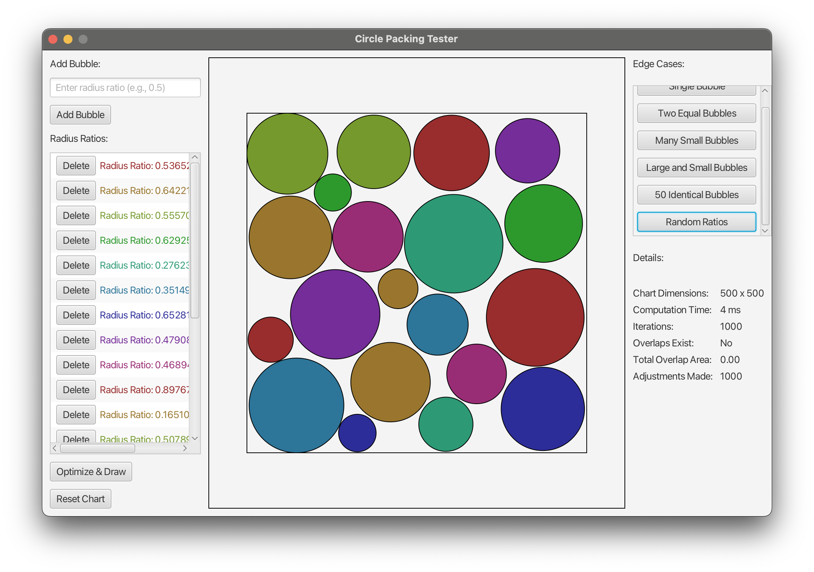

# Circle Packer

**Circle Packer** is a versatile Java-based application designed to optimize the placement of various packable objects within a rectangular area. While it includes a visual interface built with JavaFX for testing and visualization purposes, its primary goal is to provide a flexible system that can handle any Java object by making it packable through a standardized interface. This adaptability makes it suitable for diverse applications such as data visualization, layout design, and geometric optimizations. The results are managed through a generic class, ensuring flexibility and scalability.

## Table of Contents

- [Features](#features)
- [Demo](#demo)
- [Installation](#installation)
    - [Prerequisites](#prerequisites)
    - [Building the Project](#building-the-project)
- [Usage](#usage)
    - [Running the Application](#running-the-application)
    - [Application Interface](#application-interface)
- [Use Case](#use-case)
- [Edge Cases](#edge-cases)
- [Documentation](#documentation)
- [Contributing](#contributing)
- [License](#license)
- [Contact](#contact)

## Features

- **Flexible Interface:** Designed to manage and optimize any Java object by implementing the `Packable` interface.
- **Customizable Packables:** Add, remove, and customize objects with varying properties, allowing each packable to have its own unique characteristics.
- **Optimization Algorithm:** Efficiently packs objects within the defined container, minimizing overlaps and ensuring optimal space usage.
- **Predefined Edge Cases:** Test the algorithm with various predefined scenarios, such as single object, multiple identical objects, many small objects, and random properties.
- **Detailed Results:** View comprehensive details about the packing process, including computation time, number of iterations, overlap areas, and adjustments made.
- **Scalable Canvas:** Visualize the packing results on a scalable canvas, providing a clear representation for testing and demonstration purposes.
- **Generic Results Management:** Utilize a generic class to handle results, making it easy to work with different types of packable objects.

## Demo



## Installation

### Prerequisites

Before you begin, ensure you have met the following requirements:

- **Java Development Kit (JDK):** Version 17 or higher is recommended. You can download it from [AdoptOpenJDK](https://adoptopenjdk.net/) or [Oracle](https://www.oracle.com/java/technologies/javase-jdk17-downloads.html).
- **Maven:** Used for building the project. Download and installation instructions are available at [Maven's Official Website](https://maven.apache.org/install.html).
- **JavaFX SDK:** Required for JavaFX applications. Download it from [Gluon](https://gluonhq.com/products/javafx/).

### Building the Project

1. **Clone the Repository:**

   ```bash
   git clone https://github.com/yourusername/circle-packer.git
   cd circle-packer
   ```

2. **Configure JavaFX:**

   Ensure that the JavaFX SDK is correctly set up. You may need to set the `PATH_TO_FX` environment variable to point to your JavaFX SDK directory.

   ```bash
   export PATH_TO_FX=/path/to/javafx-sdk-17/lib
   ```

3. **Build with Maven:**

   The project uses Maven for dependency management and building.

   ```bash
   mvn clean install
   ```

   This command will compile the project and generate the necessary artifacts.

## Usage

### Running the Application

After successfully building the project, you can run the application using Maven or by executing the generated JAR file.

#### Using Maven:

```bash
mvn javafx:run
```

#### Using the JAR File:

1. **Navigate to the Target Directory:**

   ```bash
   cd target
   ```

2. **Run the JAR:**

   ```bash
   java --module-path $PATH_TO_FX --add-modules javafx.controls,javafx.fxml -jar circle-packer.jar
   ```

   *Ensure that `$PATH_TO_FX` points to the JavaFX SDK `lib` directory.*

### Application Interface

Upon launching the application, you'll encounter the following interface components:

1. **Dimension Input Window:**
    - **Width & Height Fields:** Input the dimensions of the container within which objects will be packed.
    - **Continue Button:** Proceed to the main application interface after entering valid dimensions.

2. **Main Application Window:**
    - **Left Panel (Control Box):**
        - **Add Packable:**
            - **Property Fields:** Input properties for a new packable object.
            - **Add Button:** Add the packable to the list.
        - **Packables ListView:** Displays all added packable objects with options to delete individual items.
        - **Optimize & Draw Button:** Run the packing algorithm and visualize the results.
        - **Reset Chart Button:** Clear all packables and reset the application.

    - **Center Panel (Canvas):**
        - **Canvas Area:** Visual representation of the container and packed objects.

    - **Right Panel:**
        - **Edge Cases:**
            - **Predefined Scenarios:** Buttons to load various edge cases for testing the packing algorithm.
        - **Details:**
            - **Container Dimensions:** Displays the size of the container.
            - **Computation Time:** Time taken to perform the packing.
            - **Iterations:** Number of iterations the algorithm performed.
            - **Overlaps Exist:** Indicates if any overlaps remain after optimization.
            - **Total Overlap Area:** Total area of overlapping regions.
            - **Adjustments Made:** Number of adjustments the algorithm made during packing.

## Use Case

The **Circle Packer** application is designed to be flexible and adaptable, allowing developers and users to manage packable objects efficiently. Below is a typical use case demonstrating how to instantiate a `Chart`, add or remove `Packable` objects, optimize the chart, and retrieve information using object IDs. This example is based on the tester application, showcasing the practical application of the interface.

### Example: Managing Packable Objects

```java
import jakepalanca.circlepacker.Chart;
import jakepalanca.circlepacker.Packable;
import jakepalanca.circlepacker.PackingResult;
import jakepalanca.circlepacker.CirclePackingTesterApp.Bubble;
import javafx.scene.paint.Color;

import java.util.UUID;

public class CirclePackingExample {

    public static void main(String[] args) {
        // Instantiate a Chart with specific dimensions
        double chartWidth = 800;
        double chartHeight = 600;
        Chart chart = new Chart(chartWidth, chartHeight);

        // Create Packable objects (Bubbles)
        Packable bubble1 = new Bubble(1.0, Color.RED);
        Packable bubble2 = new Bubble(0.5, Color.BLUE);
        Packable bubble3 = new Bubble(0.3, Color.GREEN);

        // Add Packable objects to the Chart
        chart.addPackable(bubble1);
        chart.addPackable(bubble2);
        chart.addPackable(bubble3);

        // Remove a Packable object using its UUID
        UUID idToRemove = bubble2.getId();
        chart.removePackable(idToRemove);

        // Optimize the Chart with a maximum of 1000 iterations
        int maxIterations = 1000;
        PackingResult<Packable> result = chart.optimize(maxIterations);

        // Retrieve information using the Packable's UUID
        UUID idToRetrieve = bubble1.getId();
        Packable retrievedBubble = chart.getPackables().stream()
                .filter(b -> b.getId().equals(idToRetrieve))
                .findFirst()
                .orElse(null);

        if (retrievedBubble != null) {
            System.out.println("Retrieved Bubble:");
            System.out.println("Radius Ratio: " + retrievedBubble.getRadiusRatio());
            System.out.println("Position: (" + retrievedBubble.getX() + ", " + retrievedBubble.getY() + ")");
            System.out.println("Radius: " + retrievedBubble.getRadius());
        }

        // Display Packing Results
        System.out.println("Packing Optimization Results:");
        System.out.println("Computation Time: " + result.getComputationTime() + " ms");
        System.out.println("Iterations: " + result.getIterations());
        System.out.println("Overlaps Exist: " + result.isOverlapsExist());
        System.out.println("Total Overlap Area: " + result.getTotalOverlapArea());
        System.out.println("Adjustments Made: " + result.getAdjustmentsMade());
    }
}
```

### Explanation

1. **Instantiate a Chart:**
    - Create a `Chart` object with specified width and height dimensions. The `Chart` manages the collection of `Packable` objects and handles the optimization process.

2. **Create Packable Objects:**
    - Instantiate `Bubble` objects (which implement the `Packable` interface) with different radius ratios and colors. Each `Bubble` represents a packable entity with customizable properties.

3. **Add Packable Objects:**
    - Use the `addPackable` method of the `Chart` class to add `Bubble` objects to the chart. This method assigns a unique `UUID` to each packable, facilitating easy management and retrieval.

4. **Remove a Packable Object:**
    - Remove a specific `Packable` object from the chart using its unique `UUID`. This demonstrates the ability to dynamically manage the collection of packables.

5. **Optimize the Chart:**
    - Call the `optimize` method on the `Chart` object, specifying the maximum number of iterations for the packing algorithm. This method processes the packables to arrange them within the container optimally. The `PackingResult` provides detailed information about the optimization process.

6. **Retrieve Information Using ID:**
    - Access specific `Packable` objects in the chart by filtering through the collection using their `UUID`. Retrieve and display their properties such as radius ratio, position, and radius. This showcases how to interact with individual packables post-optimization.

7. **Display Packing Results:**
    - Output the results of the packing optimization, including computation time, number of iterations, whether overlaps still exist, total overlap area, and adjustments made during the process. This provides insights into the efficiency and effectiveness of the packing algorithm.

This example demonstrates how to programmatically manage packable objects within a `Chart`, perform optimizations, and access detailed information about the packing results using object identifiers. By implementing the `Packable` interface, any Java object can be integrated into the packing system with custom properties, making **Circle Packer** highly adaptable to various use cases.

## Edge Cases

Circle Packer includes several predefined edge cases to test the robustness of the packing algorithm:

1. **Single Object:**
    - Test with only one object to ensure basic functionality.

2. **Two Equal Objects:**
    - Evaluate how the algorithm handles multiple objects of the same size.

3. **Many Small Objects:**
    - Observe the algorithm's performance with a large number of small entities.

4. **Large and Small Objects:**
    - Test with a mix of large and small objects to assess packing efficiency.

5. **Identical Objects (50 Objects of Ratio 1.0):**
    - Stress-test the algorithm with many identical-sized objects.

6. **Random Properties (20 Objects with Random Ratios):**
    - Examine how the algorithm manages objects of varying sizes and properties.

To use an edge case:

1. Navigate to the **Edge Cases** section on the right panel.
2. Click on the desired edge case button.
3. The application will load the predefined packables, optimize their placement, and display the results.

## Documentation

Comprehensive documentation is available to help you understand and extend the Circle Packer application.

### Javadoc

Detailed Javadoc comments are provided for all classes and methods. You can generate and view the Javadoc using Maven:

```bash
mvn javadoc:javadoc
```

After running the command, open the generated `index.html` located in `target/site/apidocs` to explore the documentation.

### Source Code

The source code is well-documented with inline comments explaining the functionality of classes, methods, and significant code blocks. Refer to the [Source Code](src/main/java/jakepalanca/circlepacker) directory for more details.

## Contributing

Contributions are welcome! If you'd like to improve Circle Packer, follow these steps:

1. **Fork the Repository:**

   Click the "Fork" button at the top-right corner of this page to create a copy of the repository under your GitHub account.

2. **Clone Your Fork:**

   ```bash
   git clone https://github.com/yourusername/circle-packer.git
   cd circle-packer
   ```

3. **Create a New Branch:**

   ```bash
   git checkout -b feature/YourFeatureName
   ```

4. **Make Your Changes:**

   Implement your feature or bug fix with clear and concise code. Ensure that your code follows the project's coding standards.

5. **Commit Your Changes:**

   ```bash
   git add .
   git commit -m "Add feature: YourFeatureName"
   ```

6. **Push to Your Fork:**

   ```bash
   git push origin feature/YourFeatureName
   ```

7. **Create a Pull Request:**

   Navigate to the original repository and create a pull request from your fork's branch. Provide a clear description of your changes and the reasons behind them.

## License

This project is licensed under the [MIT License](LICENSE).

## Contact

For any questions, suggestions, or feedback, please reach out:

- **Author:** Jake Palanca
- **Email:** [jakepalanca@example.com](mailto:jakepalanca@example.com)
- **GitHub:** [https://github.com/jakepalanca](https://github.com/jakepalanca)
